# Lab 01 – Manage Microsoft Entra ID Identities

**Course:** AZ-104: Microsoft Azure Administrator (Scott Duffy, Udemy)  
**Date Completed:** June 26, 2026  
**Estimated Duration:** 30 minutes  
**Lab Reference:** [Official Microsoft Lab Instructions](https://github.com/MicrosoftLearning/AZ-104-MicrosoftAzureAdministrator/blob/master/Instructions/Labs/LAB_01-Manage_Entra_ID_Identities.md)

---

## Scenario

A new lab environment is being built for pre-production testing. Engineers need to authenticate using Microsoft Entra ID. The task is to provision internal users, invite an external guest, and organize them into a security group.

---

## Environment

Working inside the Default Directory tenant in Microsoft Entra ID Free.

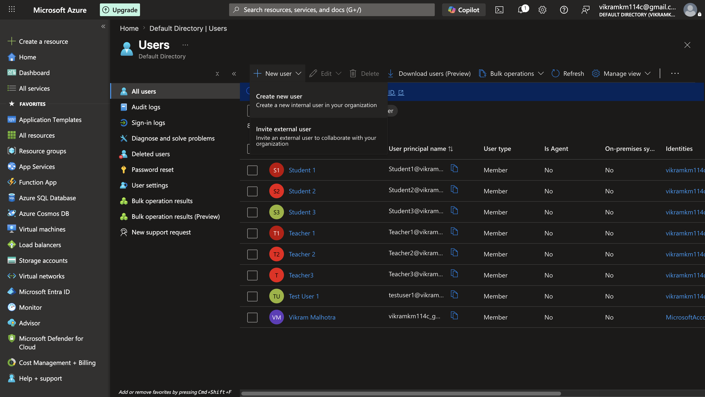

| Detail | Value |
|---|---|
| Tenant name | Default Directory |
| Primary domain | vikramkm114cgmail.onmicrosoft.com |
| Tenant ID | 6ea7cd29-9aab-41fd-a026-602b66435a16 |
| License | Microsoft Entra ID Free |

---

## Task 1 – Create and Configure User Accounts

### 1a. Created an internal user (`az104-user1`)

Navigated to **Microsoft Entra ID → Users → New user → Create new user**.

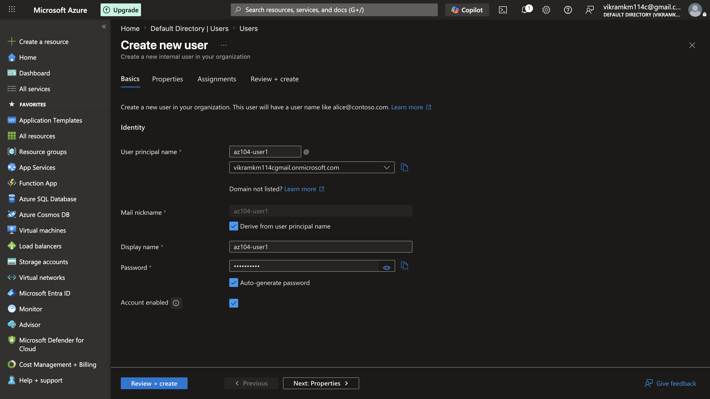

| Setting | Value |
|---|---|
| User principal name | az104-user1@vikramkm114cgmail.onmicrosoft.com |
| Display name | az104-user1 |
| Password | Auto-generated |
| Job title | IT Lab Administrator |
| Department | IT |
| Usage location | United States |

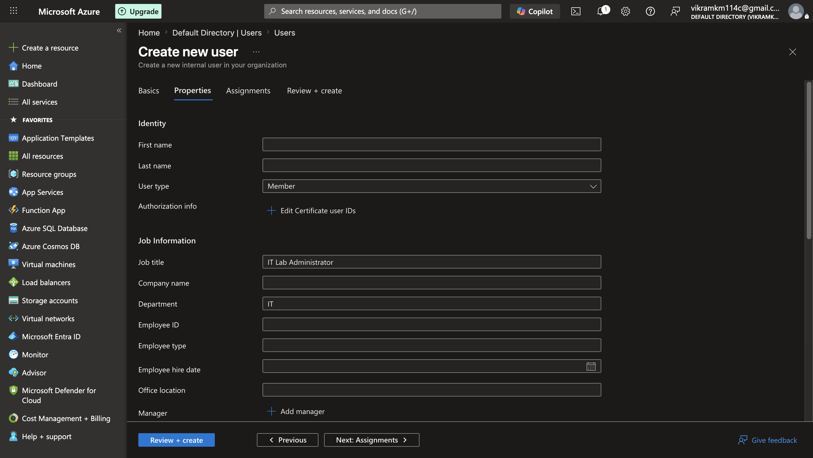
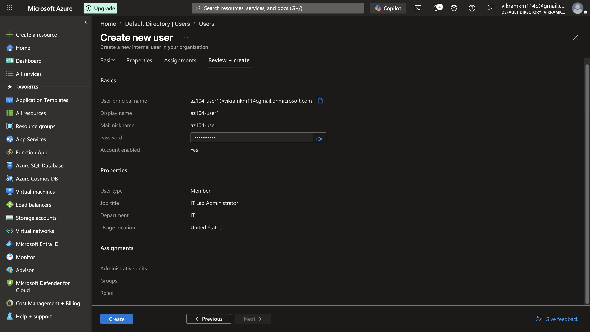
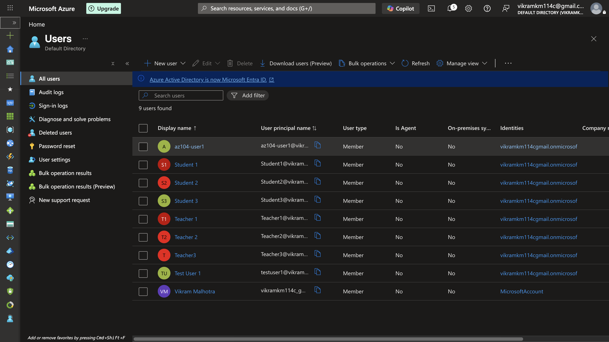

---

### 1b. Invited an external guest user

Navigated to **New user → Invite external user** to simulate a B2B guest scenario using a secondary Gmail address.

| Setting | Value |
|---|---|
| Email | vikramkm114a@gmail.com |
| Display name | Vikram Malhotra |
| User type | Guest |
| Job title | IT Lab Administrator |
| Department | IT |
| Usage location | United States |

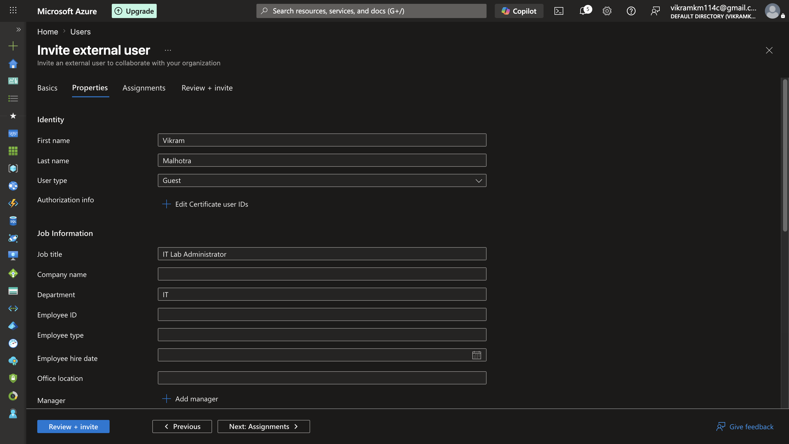
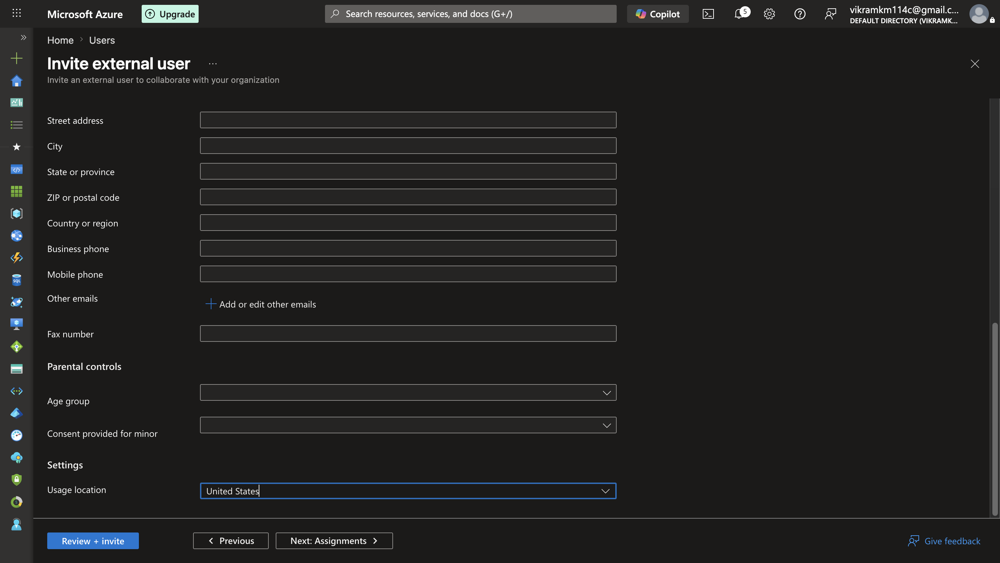
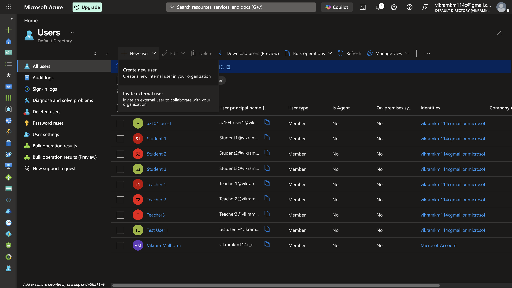

**Result:** Both users confirmed in the directory — `az104-user1` as Member and guest `Vikram Malhotra` as Guest (10 total users).

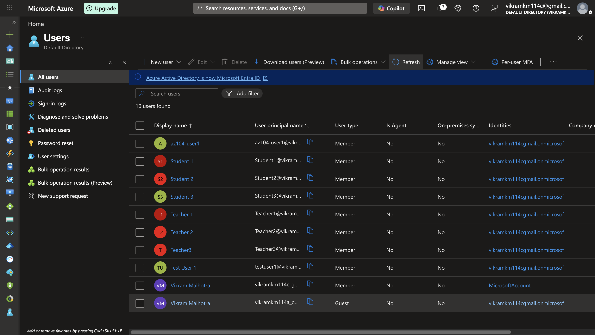

> **Troubleshooting note:** My first invite attempt used the same email address already associated with my admin account. Azure treated it as an existing identity and did not create a new guest entry — no error, it just silently resolved to the existing account. Re-inviting with a different email address resolved this. Key lesson: Entra ID deduplicates identities across Microsoft accounts. You cannot invite an email address that already exists in the tenant as a new guest.

---

## Task 2 – Create a Group and Add Members

### Created the `IT Lab Administrators` security group

Navigated to **Microsoft Entra ID → Groups → New group**.

| Setting | Value |
|---|---|
| Group type | Security |
| Group name | IT Lab Administrators |
| Description | Administrators that manage the IT lab |
| Membership type | Assigned |
| Owner | Vikram Malhotra (admin account) |
| Members | az104-user1 (Member), Vikram Malhotra (Guest) |

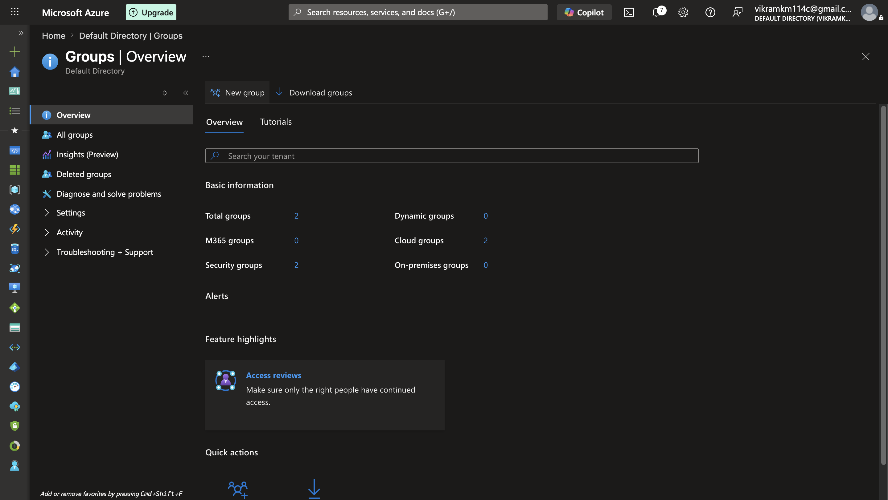

**Result:** Group confirmed in the directory alongside two pre-existing groups.

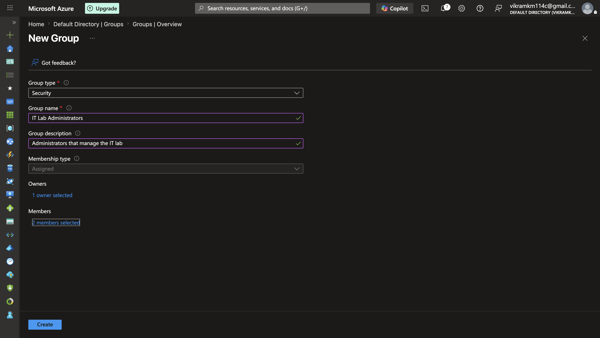
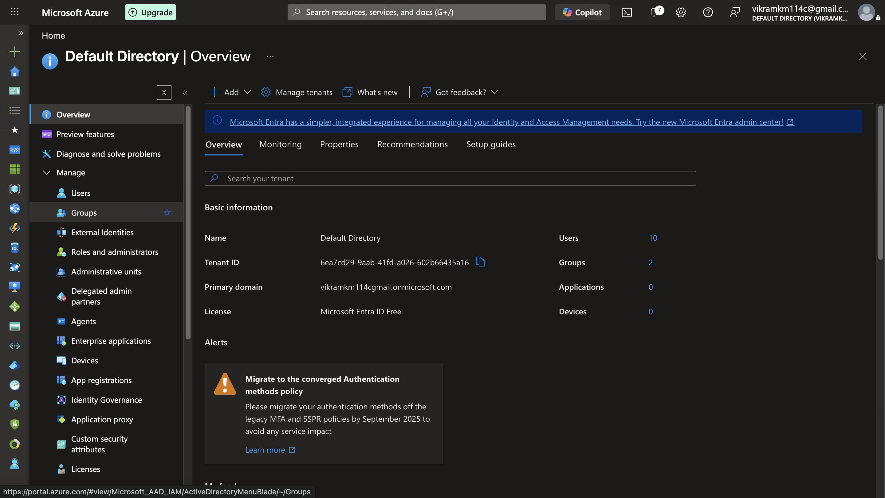
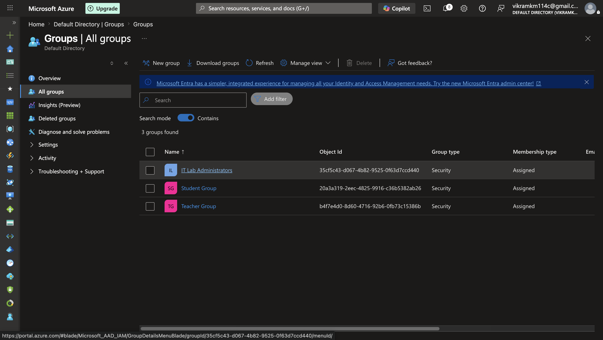
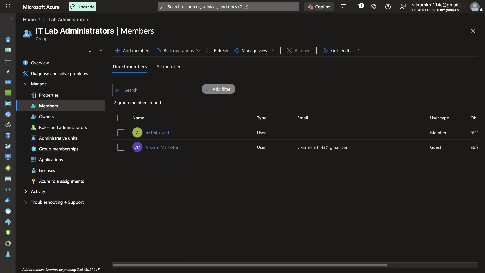
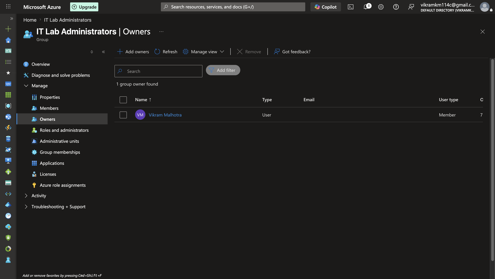

---

## Key Takeaways

- A **tenant** is a dedicated instance of Microsoft Entra ID representing your organization. All users, groups, and applications live within a tenant.
- **Internal users** (Members) are provisioned directly in the directory. **Guest users** are external identities invited via B2B collaboration — they authenticate with their own identity provider but are granted scoped access to your tenant's resources.
- Entra ID deduplicates identities — inviting an email already registered in the tenant will not create a new guest account.
- **Security groups** can contain a mix of Members and Guests and are used to manage access to Azure resources, applications, and licenses at scale.
- **Dynamic membership** (auto-updating based on user attributes like job title) requires Entra ID Premium P1 or P2. With the free license, only **Assigned** membership is available.

---

## Directory Summary (Post-Lab)

| Metric | Value |
|---|---|
| Total users | 10 |
| Total groups | 3 |
| Security groups | 2 |
| Dynamic groups | 0 |
| License | Microsoft Entra ID Free |
| Primary domain | vikramkm114cgmail.onmicrosoft.com |
